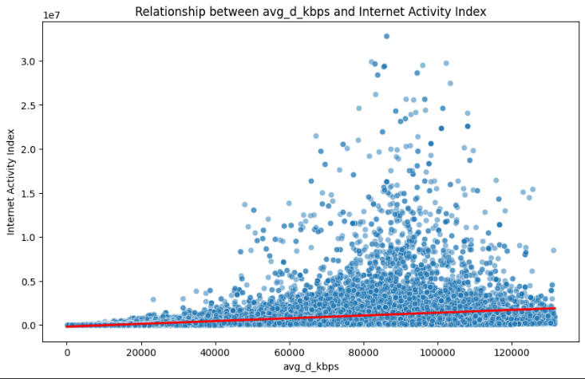

# Economic Growth Prediction Project

## Project Description
This project investigates the relationship between changes in nighttime light intensity and internet speeds, exploring their combined impact on economic development. Using data from Ookla (internet speeds) and VIIRS (nighttime radiance), the project focuses on three Brazilian cities (Rio de Janeiro, Bahia, and São Paulo) during the first quarter of 2020. The findings aim to provide actionable insights into how digital infrastructure and urban activity influence regional economic growth.

## Key Features
- **Data Collection and Integration**:
  - Internet performance metrics from Ookla, including download/upload speeds and latency.
  - Nighttime radiance data from VIIRS, serving as a proxy for urban activity.
  - Harmonized spatial and temporal datasets for seamless analysis.

- **Exploratory Data Analysis (EDA)**:
  - Identified trends and correlations between nighttime lights and internet speeds.
  - Used Python tools like Pandas, Matplotlib, and Seaborn for data visualization.

- **Statistical Analysis**:
  - Conducted hypothesis testing to evaluate the relationship between nighttime radiance (urban activity) and internet speeds (digital infrastructure).  
    - **Pearson Correlation Analysis**:  
      - Measured the strength and direction of the relationship between `light_intensity` and `avg_d_kbps` (download speed).  
      - **Result**: Correlation coefficient of **0.41** with a **p-value < 0.05**, indicating a statistically significant positive relationship.  
    - **Linear Regression Analysis**:  
      - Modeled the dependency of the "Internet Activity Index" on radiance and download speeds.  
      - **Result**: Regression coefficients were statistically significant, with a p-value of **0.025** and an adjusted R-squared value of **0.357**, suggesting a strong model fit.  
    - **Outlier Detection**:  
      - Applied boxplot analysis to detect and remove outliers, improving the accuracy and robustness of statistical models.  
  - Adjusted results for geographic and demographic variables to ensure robustness.
  - Scatter plots with regression lines illustrate the relationships:  
      
      

- **Visualizations**:
  - Heatmaps showcasing regional variations in internet speeds and urban radiance.  
      
  
  - Scatter plots and geospatial overlays highlighting economic hotspots.  
      
      
      

  - Time-series analyses revealing temporal trends.  
      

## Results
- **Key Findings**:
  - Positive correlation between urban radiance and internet speeds, indicating that regions with higher urban activity tend to have better digital infrastructure.
  - Areas with improved internet connectivity and urban development exhibit stronger economic growth.

- **Visual Outputs**:
  - Heatmaps identifying high-growth areas based on radiance and connectivity.
  - Geospatial overlays mapping regions with high economic potential.
  - Comparative bar charts and scatter plots for deeper insights.

## Conclusion
The project demonstrates the critical role of digital infrastructure and urban planning in fostering economic development. By highlighting the connection between technological advancements and human activity, this study provides valuable guidance for policymakers and stakeholders aiming to drive economic growth.

## Future Work
- Refining predictive models to include additional metrics like population density and income levels.
- Expanding the analysis to include more cities and temporal periods for broader insights.

## Team
- **[Dr. Noha Gamal](https://www.linkedin.com/in/dr-noha-gamaleldin-383ab820/)** (Supervisor)
- **[Omar Elhossiny](https://www.linkedin.com/in/omar-elhossiny-530553261)** (Team Leader)
- **[Abdelrahman Ahmed](https://www.linkedin.com/in/abdelrahman-ahmed-9b0828252/)**
- **[Sherif Ahmed Mahmoud](https://www.linkedin.com/in/sherif-ahmed-1a611b2aa/)**
- **[Amr Mohamed El-Hassaneen](https://www.linkedin.com/in/amr-mohamed-a5b00924b/)**
- **[Zeyad Shawky]()**

## Code and Data
The code and datasets used in this project are available [here](https://drive.google.com/drive/folders/1eVoNOR-wE43dlRux4ZAD8TZIFdSlHpiv?usp=sharing).

